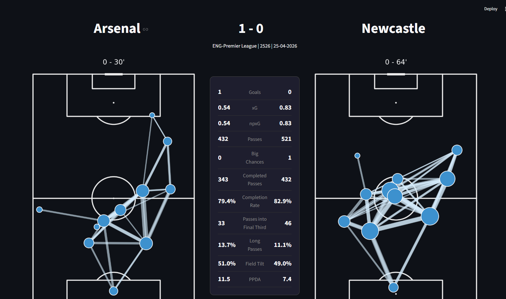
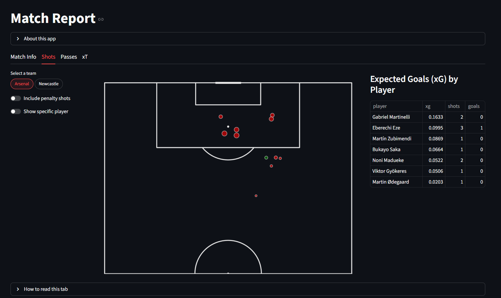
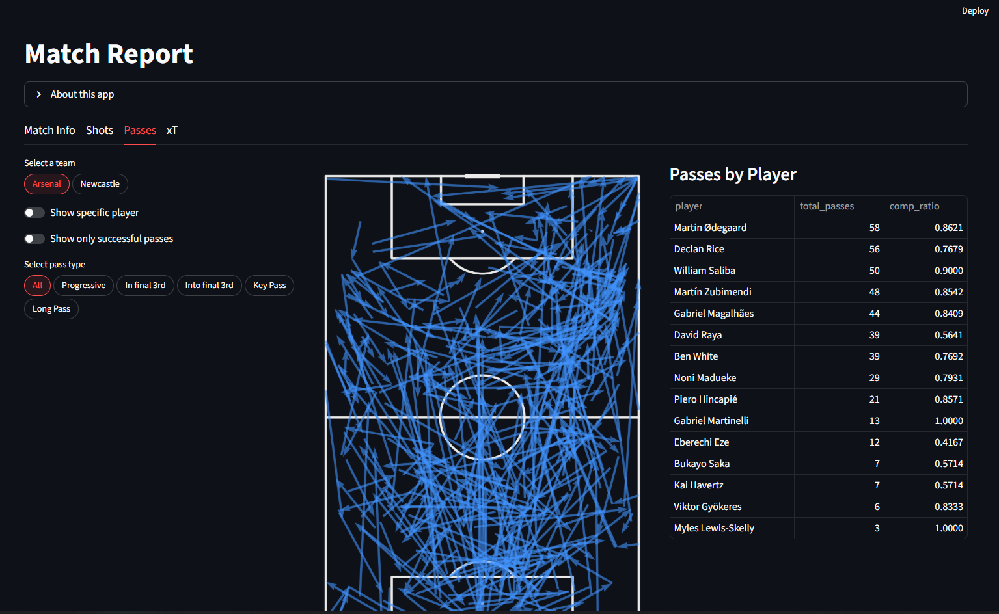
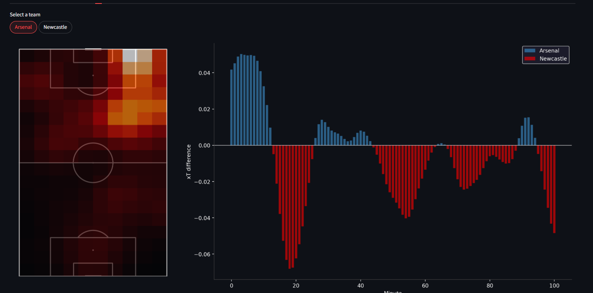

# Match Report Dashboard

An interactive football analytics dashboard built with Streamlit, powered by Opta/WhoScored event data. Provides in-depth match analysis through custom machine learning models and advanced visualizations.

---

## Features

### Match Info
Side-by-side pass network maps for both teams, with key match statistics including goals, xG, npxG, pass completion rate, passes into the final third, big chances, field tilt and ppda.

### Shots & xG
Shot map with xG values derived from a custom-trained XGBoost model. Filter by team or individual player, with an option to exclude penalty kicks.

### Passes
Interactive pass map with support for multiple pass types — progressive passes, key passes, passes into the final third, and long passes. Filter by team or individual player, with an option to show only successful passes.

### xThreat (xT)
Heatmap showing where on the pitch each team generated the most threat through passing, and a flow chart showing the per-minute xT difference between both teams smoothed using a rolling average.

---

## Tech Stack

| Layer | Technology |
|---|---|
| Frontend | Streamlit |
| Data | Opta/WhoScored event data |
| Database | PostgreSQL via Supabase |
| ML Models | XGBoost (xG), xT model |
| Visualizations | mplsoccer, matplotlib |
| Language | Python |

---

## Models

**xG Model** — XGBoost classifier trained on shot data (Opta event data). Features include shot location, shot type, assist type, and game state. Trained without own goals and tuned with Optuna.

**xT Model** — Expected threat model sourced from [adnaaan433/Post-Match-Report-2.0](https://github.com/adnaaan433/Post-Match-Report-2.0), quantifying how much each pass increased a team's probability of scoring.